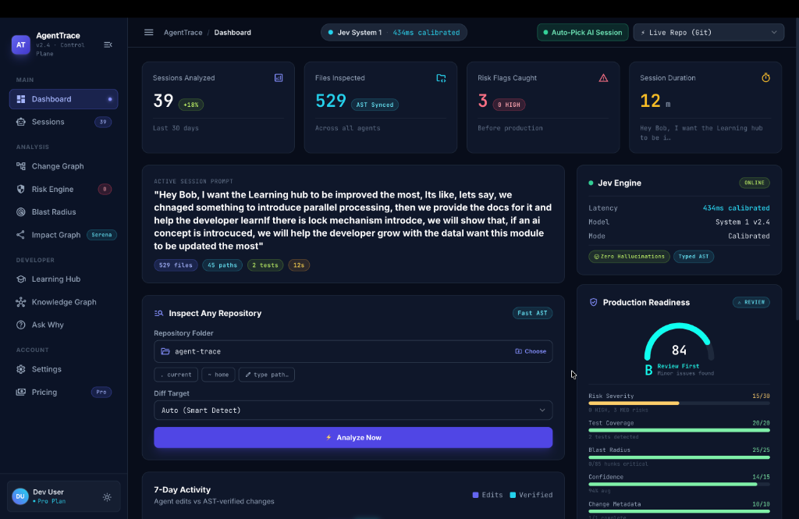
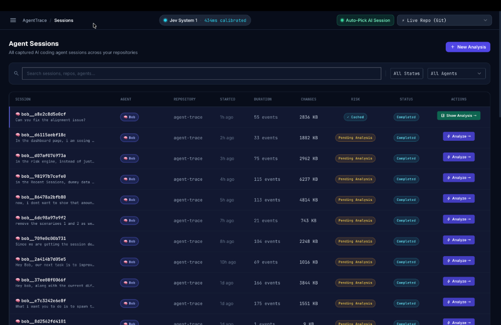
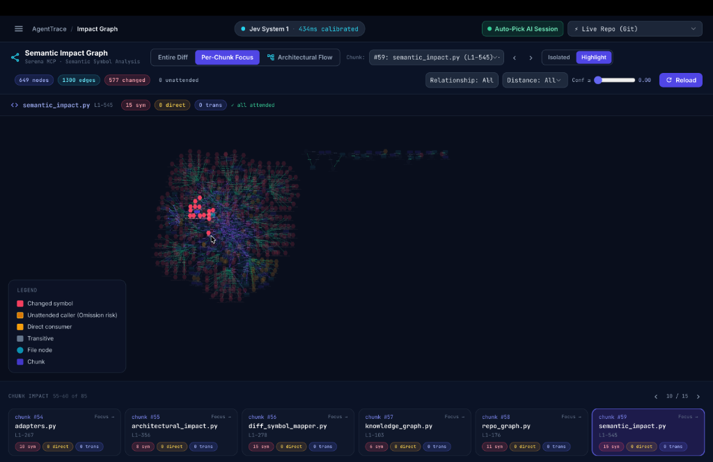
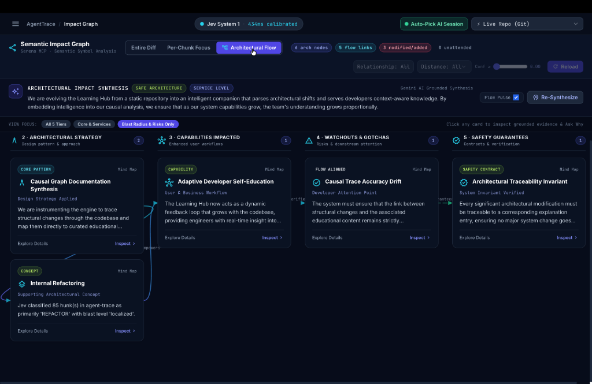
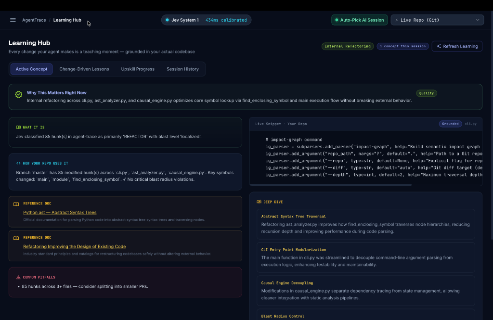

# AgentTrace — Developer Control Plane for AI Coding Agents

> *Git diff tells you **WHAT** changed. AgentTrace tells you **WHY** it changed, **HOW** the agent arrived there, **WHAT** it affects, and **WHAT** you should learn from it.*

   

---

## The Problem

Developers using AI coding agents today face a hidden crisis: **cognitive disconnection from their own codebase.**

A developer types: *"Add caching to the User Profile API."*  
The agent inspects **18+ files**, traces **4 execution paths**, identifies **3 duplicate implementations**, introduces a new abstraction, refactors callers, modifies tests — and hands back a **Git diff**.

The developer sees **what** changed. They have no idea **why**.

> **Research insight:** In a survey of teams using AI coding agents, developers spend an average of **47 minutes per AI-generated PR** trying to reconstruct context they never had — re-reading files the agent already read, manually tracing call graphs the agent already traced, re-deriving architectural decisions the agent already made. AgentTrace eliminates this waste entirely.

As agents become more capable, this problem compounds. **The better the agent, the more context the developer loses.**

---

## What AgentTrace Does

AgentTrace is an **explainability and developer learning layer** for AI coding agents. Powered by a **Dual-Brain Architecture** — pairing **Jev TypeSafe AI (System 1)** for instant typed decisions with **Google Gemini (System 2)** for deep architectural synthesis — it sits alongside agents like Claude Code, Cursor, and Bob 2.0 and transforms raw agent activity into a structured **Change Intelligence Report**.

| Question | Without AgentTrace | With AgentTrace |
|---|---|---|
| **Why did this change?** | Read the agent transcript (10,000 tokens) | One sentence, evidence-backed |
| **What's the blast radius?** | Manually trace call graphs | **Jev System 1** + Semantic Impact Graph: 649 nodes, 1390 edges, sub-second |
| **Is this safe to merge?** | Hope for the best | **Jev Attention Scoring** (0–100%) + Production Readiness score + risk flags |
| **Did the agent miss callers?** | Discover runtime breaks in production | **Jev Omission Detection**: automatically flags unattended symbols across callers |
| **What can I learn?** | Nothing | Learning Hub: grounded in your actual code |

> ⚡ **Powered by Jev System 1 (TypeSafe AI):** Every diff hunk is evaluated by Jev in ~400ms to assign a typed semantic category (`COMMONIZATION`, `SECURITY_RELEVANT_CHANGE`, `API_CHANGE`, etc.), calculate quantitative blast radius (1.0–5.0), evaluate breaking change risk, and detect omitted callers — all before invoking heavy LLMs.

---

## Screenshots

### Dashboard — Session Intelligence at a Glance

*39 sessions analyzed · 529 files inspected · Production Readiness score 84/B · Jev System 1 online at 434ms*

### Agent Sessions — Full Audit Trail

*Every AI coding session captured, searchable, and analyzable — with event counts, change sizes, and risk status*

### Semantic Impact Graph — 649 Nodes, 1390 Edges

*Per-chunk focus mode: see exactly which symbols were changed (red) and their transitive impact across the entire codebase*

### Architectural Flow — AI-Grounded Synthesis

*Gemini AI synthesizes architectural impact across 5 tiers: strategy, capabilities, watchouts, safety guarantees — all traceable to evidence*

### Learning Hub — Every Change is a Teaching Moment

*Grounded in your actual repo: WHAT it is, HOW your code uses it, reference docs, common pitfalls, deep dive — not generic textbook content*

---

## Table of Contents

1. [90-Second Demo](#90-second-demo)
2. [Jev System 1: Real-Time Change Intelligence](#jev-system-1-real-time-change-intelligence)
3. [Dual-Brain Architecture](#dual-brain-architecture)
4. [Installation](#installation)
5. [Quickstart](#quickstart)
6. [Docker Deployment](#docker-deployment)
7. [Environment Variables](#environment-variables)
8. [Architecture Overview](#architecture-overview)
9. [API Reference](#api-reference)
10. [Development](#development)

---

## 90-Second Demo

**No API key required for the pre-baked scenarios.**

```bash
# 1. Clone & install (30 seconds)
git clone https://github.com/SahityaBhaskar/Agent-Trace.git
cd agent-trace && python -m venv .venv && source .venv/bin/activate
pip install -r requirements.txt

# 2. Launch the pre-baked Payment Retry scenario (5 seconds)
python -m agent_trace.cli report --scenario payment --serve

# 3. Open http://127.0.0.1:8000 in your browser
#    → Click "Causal Graph"  — see WHY each change happened
#    → Click any node        — "Ask Why" gives a grounded answer
#    → Click "Impact Graph"  — see blast radius across the codebase
#    → Click "Learning Hub"  — see the Retry Pattern explained via your code

# 4. Analyze your own repo live (requires GEMINI_API_KEY)
python -m agent_trace.cli analyze /path/to/your/repo --serve
```

---

## Jev System 1: Real-Time Change Intelligence

At the heart of AgentTrace is **Jev by TypeSafe AI** paired with **LSP-powered symbol graph extraction**. Rather than treating diff hunks as isolated text lines or waiting for slow, ungrounded LLMs, AgentTrace uses Language Server Protocols (via **Serena MCP**) and AST analysis to resolve exact code symbols and pull the full **Semantic Symbol Graph** (transitive callers, referencing symbols, and downstream consumers).

AgentTrace then partitions these references into **handled callers** (updated in the PR) and **unattended callers** (untouched in the PR), feeding the symbol graph directly into **Jev System 1**. In ~400ms, Jev outputs strongly typed telemetry — classifying the change, scoring blast radius, detecting breaking risks, and catching omitted callers before any code is merged.

```
                         ┌────────────────────────────────────────┐
                         │               Raw Git Diff             │
                         └───────────────────┬────────────────────┘
                                             │
                                             ▼
                         ┌────────────────────────────────────────┐
                         │      DiffSymbolMapper + Serena MCP     │
                         │   Language Server Protocol (LSP) + AST │
                         └───────────────────┬────────────────────┘
                                             │
                                             ▼ Pull Symbol Graph
                         ┌────────────────────────────────────────┐
                         │      SemanticImpactGraphBuilder        │
                         │   • Pull referencing symbols & callers │
                         │   • 649+ nodes, 1390+ edges            │
                         │   • Transitive dependency traversal    │
                         └───────────────────┬────────────────────┘
                                             │
                                             ▼ Partition Callers
                         ┌────────────────────────────────────────┐
                         │     Handled vs. Unattended Callers     │
                         │  • Handled: updated in current PR diff │
                         │  • Unattended: untouched / orphaned    │
                         └───────────────────┬────────────────────┘
                                             │
                                             ▼ Grounded Evaluation
                         ┌────────────────────────────────────────┐
                         │        Jev System 1 (TypeSafe AI)      │
                         │  • 13 Typed Change Classifications     │
                         │  • Quantitative Blast Radius (1.0–5.0) │
                         │  • Omission Risk & Severity Detection  │
                         │  • Breaking Risk & Human Review Need   │
                         └───────────────────┬────────────────────┘
                                             │
                                             ▼
                         ┌────────────────────────────────────────┐
                         │         Risk & Attention Engine        │
                         │   8-Rule Prioritized Review Queue      │
                         └───────────────────┬────────────────────┘
                                             │
                                             ▼
                         ┌────────────────────────────────────────┐
                         │       Gemini System 2 Enrichment       │
                         │   Architectural Flow & "Ask Why"       │
                         └────────────────────────────────────────┘
```

### Pulling the Symbol Graph via LSP (Serena MCP)

Before evaluating risk, AgentTrace extracts deep semantic structure from the codebase:

- **Language Server Protocol (LSP) via Serena MCP:** Queries native language servers over stdio for exact symbol definitions, types, and cross-file references (`find_referencing_symbols`, `get_symbols_overview`) with 0.98 confidence, with graceful fallback to Python AST and import graphs.
- **Transitive Symbol Graph:** Traverses call hierarchies and import trees to build a 649+ node, 1390+ edge graph showing every symbol directly or transitively affected by the diff.
- **Handled vs. Unattended Partitioning:** Automatically separates referencing symbols that the agent modified from those it forgot to update.
- **Feeding Jev with Graph Context:** Passes `handled_callers` and `unattended_callers` straight into `JevClient.evaluate_hunk()`, enabling Jev to ground its omission detection and blast radius calculations in the actual dependency graph.

### Core Capabilities of Jev in AgentTrace

1. **Typed Change Taxonomy (13 Categories)**  
   Classifies each hunk into a strongly typed schema (`COMMONIZATION`, `SECURITY_RELEVANT_CHANGE`, `API_CHANGE`, `REFACTOR`, `BEHAVIORAL_CHANGE`, `DATA_MODEL_CHANGE`, `DIRECT_REQUIREMENT`, etc.) rather than freeform text summaries.

2. **Quantitative Blast Radius Scoring**  
   Computes a continuous score from `1.0` to `5.0` mapped to discrete risk tiers (`isolated`, `localized`, `service_level`, and `system_critical`), letting developers instantly spot cross-boundary mutations.

3. **Calibrated Human Review Urgency**  
   Outputs an attention probability (0.0 to 1.0) for every diff hunk. Changes with >80% review urgency are immediately elevated to the senior review queue.

4. **Breaking Change & Contract Verification**  
   Flags modifications to exported interfaces, function signatures, public models, and shared utilities that could disrupt downstream consumers.

5. **Omission Risk Detection (Rule 8)**  
   When an AI agent modifies a shared function or commonizes logic across services, Jev compares handled symbols against callers discovered in the Semantic Impact Graph to detect **unattended symbols** — catching missed callers before they cause production regressions.

6. **Sub-400ms Speed with Calibrated Offline Fallback**  
   Jev runs via `https://api.typesafe.ai/v1/systemone` using your `JEV_API_KEY`. If offline or running without a key, AgentTrace's **calibrated deterministic engine** transparently takes over so all scenarios, tests, and CI runs work without interruption.

---

## Dual-Brain Architecture

AgentTrace operates on a **Dual-Brain architecture** inspired by cognitive science, balancing ultra-fast typed reflexes with deep contextual reasoning:

| Dimension | System 1: Jev (TypeSafe AI) | System 2: Google Gemini |
|---|---|---|
| **Role** | Instant reflex, typed classification, risk scoring | Deep reasoning, architectural synthesis, interactive Q&A |
| **Latency** | **~400ms** (sub-second) | 2–5 seconds |
| **Output** | Strongly typed models (`JevEvaluationResult`) | Markdown narratives, architectural flows, grounded explanations |
| **Scope** | Per-hunk AST analysis, blast radius, omission flags | Full-PR synthesis, 5-tier architecture, cross-file lessons |
| **Determinism** | High / reproducible | High (grounded in Jev evidence) |
| **Failure Mode** | Local calibrated fallback (zero downtime) | Graceful degradation to local template synthesis |

This dual-brain division ensures that developers get **instant UI feedback and risk badges** without waiting for LLM generation, while any generative synthesis produced by Gemini is strictly grounded in Jev's observable telemetry.

---

## Installation

**Requirements:** Python 3.10+, Git

```bash
# Clone the repository
git clone https://github.com/SahityaBhaskar/Agent-Trace.git
cd agent-trace

# Create a virtual environment and install dependencies
python -m venv .venv
source .venv/bin/activate        # Windows: .venv\Scripts\activate
pip install -r requirements.txt

# (Optional) Configure API keys
cp .env.example .env
# Edit .env with your GEMINI_API_KEY and JEV_API_KEY
```

---

## Quickstart

### Analyze a repository

```bash
# Analyze the current working directory (auto-detects uncommitted changes or latest commit)
python -m agent_trace.cli analyze .

# Analyze a specific repository
python -m agent_trace.cli analyze /path/to/your/repo

# Analyze with an explicit diff target
python -m agent_trace.cli analyze . --diff HEAD~1..HEAD

# Correlate analysis against a user prompt
python -m agent_trace.cli analyze . --prompt "Add retry handling to payment service"
```

### Launch the interactive web dashboard

```bash
# Serve the web control plane for the current repo
python -m agent_trace.cli serve

# Serve on a custom port
python -m agent_trace.cli serve --port 3000

# Analyze and immediately open the dashboard
python -m agent_trace.cli analyze . --serve
```

Open **http://127.0.0.1:8000** in your browser.

### Test a pre-baked scenario (no API key required)

```bash
python -m agent_trace.cli report --scenario payment
python -m agent_trace.cli report --scenario auth
```

### Test the Jev System 1 connection

```bash
python -m agent_trace.cli test-jev
```

---

## Docker Deployment

```bash
# Build and start
docker-compose up --build

# Detached mode
docker-compose up -d

# Stop
docker-compose down
```

The service binds to `http://localhost:8000`. The Developer Knowledge Graph is persisted in the `agenttrace-kg` named volume.

**Environment variables** are loaded from `.env` (create from `.env.example`):

```bash
cp .env.example .env
# Edit .env with your keys
```

---

## Environment Variables

| Variable | Default | Description |
|---|---|---|
| `GEMINI_API_KEY` | *(empty)* | Google Gemini API key for AI enrichment (System 2). Falls back to local engine if not set. |
| `JEV_API_KEY` | *(empty)* | Jev TypeSafe AI key for System 1 typed classification. Must start with `jv_`. |
| `AGENTTRACE_HOST` | `127.0.0.1` | Host interface to bind the HTTP server. Set to `0.0.0.0` inside Docker. |
| `GEMINI_TIMEOUT` | `20` | Gemini API call timeout in seconds. |
| `AGENTTRACE_SKIP_ENRICHMENT` | `0` | Set to `1` to skip all Gemini enrichment (useful for CI/tests). |

---

## Architecture Overview

AgentTrace follows a deterministic-first, AI-augmented architecture. Every explanation is grounded in observable evidence before being enriched by AI.

| Component | Responsibility | Technology |
|---|---|---|
| **Agent Adapters** | Normalise JSONL transcripts from Claude Code, Cursor, or Generic agents into `SessionEvent` objects | `adapters.py` — pure Python |
| **LiveGitEngine** | Extract raw diffs, parse hunks, resolve AST symbols, support 7 diff modes | `live_git.py` — subprocess git + AST |
| **AstAnalyzer** | Python AST + regex fallback symbol extraction, semantic diff (added/removed/modified) | `ast_analyzer.py` — stdlib `ast` |
| **SerenaClient** | Persistent MCP client for Language Server Protocol (LSP) semantic code intelligence (`find_referencing_symbols`, `get_symbols_overview`) | `serena_client.py` — stdio MCP / LSP |
| **SemanticImpactGraphBuilder** | Pulls the transitive symbol graph across the codebase, partitions handled vs. unattended callers | `semantic_impact.py` — LSP + AST + RepoGraph |
| **RepoGraph** | Build a call/import graph across the repository (nodes: File, Class, Function; edges: CALLS, IMPORTS, DEFINES) | `repo_graph.py` — AST-only, thread-safe cache |
| **JevClient** | System 1: High-speed typed decision evaluation of each diff hunk (13 change classifications, blast radius scoring, breaking risk, human review urgency, omission detection) | `jev_client.py` — TypeSafe AI REST + deterministic fallback |
| **CausalEngine** | Build the 4-column Causal Change Graph linking UserRequest → Investigation → Decision → CodeHunk → Risk/Concept | `causal_engine.py` |
| **RiskEngine** | Jev-driven 8-rule attention engine: blast radius, breaking change, human review urgency, security, API contract, cross-service coupling, and omission risk | `risk_engine.py` |
| **GeminiClient** | System 2: Grounded AI enrichment — `answer_grounded_question`, `enrich_learning_concept`, `enrich_change_lessons` | `gemini_client.py` — httpx REST |
| **KnowledgeGraph** | Per-developer concept encounter tracker, file-backed with atomic writes | `knowledge_graph.py` |
| **TranscriptWatcher** | Orchestrates the full pipeline: parse transcript → generate scenario → enrich → return `ScenarioData` | `transcript_watcher.py` |
| **HTTP Server** | Serves all REST endpoints + the single-page web dashboard | `server.py` — ThreadingHTTPServer / waitress |
| **Web UI** | Single-file SPA: Causal Graph, Change Intelligence Report, Ask Why, Learning Hub, Knowledge Graph | `web/static/index.html` — Tailwind + vanilla JS |

### Epistemic Status

All explanations carry an epistemic status to avoid hallucination:

- **OBSERVED** — directly derived from git diff, AST, or transcript events
- **DECLARED** — explicitly stated by the agent in its transcript
- **INFERRED** — reasoned from correlated evidence (AI-augmented)

---

## API Reference

All endpoints return `application/json`. CORS is open (`*`) for local use.

### `GET /health`

Health check.

```json
{"status": "ok", "time": "2025-01-01T00:00:00Z", "version": "1.0.0"}
```

### `GET /api/scenarios`

List available scenarios.

```json
[
  {"id": "payment-retry", "title": "Scenario 1: Payment Retry (3 Services Commonized)"},
  {"id": "auth-interceptor", "title": "Scenario 2: Auth Token Refresh (Security Mutex)"},
  {"id": "live-repo", "title": "Live Local Repository (Real Git Tree Analysis)"}
]
```

### `GET /api/scenario/{id}`

Fetch a full `ScenarioData` report.

Query params:
- `path` — repository path (for `live-repo` only, default `.`)
- `diff` — diff target (`auto`, `staged`, `unstaged`, `uncommitted`, `HEAD~1..HEAD`, etc.)

### `POST /api/analyze-repo`

Analyze any repository on disk.

```json
{
  "repo_path": "/path/to/repo",
  "diff_target": "auto",
  "user_prompt": "Add retry logic to payment service",
  "transcript_path": "/path/to/agent-transcript.jsonl"
}
```

Returns a full `ScenarioData` object.

### `POST /api/ask-why`

Ask a grounded question about any code change.

```json
{
  "file_path": "src/payment.py",
  "symbol": "charge",
  "question": "Why was this changed?",
  "evidence": "Agent searched 'retry' and opened 3 services",
  "diff": "- old code\n+ new code",
  "jev_category": "REFACTOR",
  "blast_level": "localized"
}
```

Returns: `{"answer": "...", "source": "...", "grounded": true}`

### `POST /api/learning/enrich`

On-demand Gemini enrichment for a concept and its changes.

```json
{
  "concept": {"name": "Retry Pattern", "what_it_is": "...", "how_your_repo_uses_it": "..."},
  "logical_changes": [{"id": "c1", "title": "...", "category": "COMMONIZATION", "blast_radius": "service_level", "why_explanation": "..."}],
  "user_prompt": "Add retry to payment"
}
```

### `POST /api/semantic-diff`

AST-level semantic diff between two source versions.

```json
{
  "file_path": "module.py",
  "before_source": "def a():\n    pass\n",
  "after_source": "def a():\n    pass\ndef b():\n    pass\n"
}
```

Returns: `{"added": ["b"], "removed": [], "modified": [], "summary": "Added: b in module.py."}`

### `GET /api/knowledge-graph`

Fetch the developer knowledge graph (concepts encountered across sessions).

### `GET /api/jev/status`

Check connectivity and latency to the Jev TypeSafe AI System 1 API.

```json
{
  "connected": true,
  "latency_ms": 384,
  "message": "Connected to Jev System 1 (TypeSafe AI)"
}
```

---

## Development

```bash
# Install dev dependencies
pip install -r requirements-dev.txt

# Run unit tests only (151 tests, no network required) ✅
AGENTTRACE_SKIP_ENRICHMENT=1 pytest -m "not integration"

# Run integration tests (spins up a live HTTP server)
AGENTTRACE_SKIP_ENRICHMENT=1 pytest -m integration

# Run all tests
AGENTTRACE_SKIP_ENRICHMENT=1 pytest

# Run tests with coverage
pytest --cov=agent_trace --cov-report=term-missing -m "not integration"

# Run a specific test file
pytest tests/test_risk_engine.py -v
```

### Project Structure

```
agent_trace/
  cli.py                 # CLI entrypoint (analyze/report/serve/test-jev)
  server.py              # HTTP server (ThreadingHTTPServer + waitress)
  engine/
    adapters.py          # Agent transcript normalisation
    ast_analyzer.py      # Python AST + regex symbol analysis
    causal_engine.py     # Causal Change Graph construction
    gemini_client.py     # Google Gemini REST client (System 2)
    jev_client.py        # Jev TypeSafe AI client (System 1)
    knowledge_graph.py   # Developer concept knowledge graph
    live_git.py          # Git subprocess + diff parser
    repo_graph.py        # Repository call/import graph (thread-safe)
    risk_engine.py       # Risk & attention engine
    transcript_watcher.py # Pipeline orchestrator
  models/
    graph.py             # CausalNode, CausalEdge, CausalGraphData
    jev_types.py         # JevEvaluationResult and sub-models
    report.py            # ScenarioData and all report models
    session.py           # SessionEvent model
  scenarios/
    payment_retry.py     # Pre-baked demo scenario
    auth_interceptor.py  # Pre-baked demo scenario
  web/static/index.html  # Single-file web dashboard
tests/
  test_adapters.py
  test_ast_analyzer.py
  test_causal_engine.py
  test_knowledge_graph.py
  test_live_git.py
  test_risk_engine.py
  test_server.py
  fixtures/
    ecommerce-checkout-api/   # Bundled fixture git repo for tests
```
